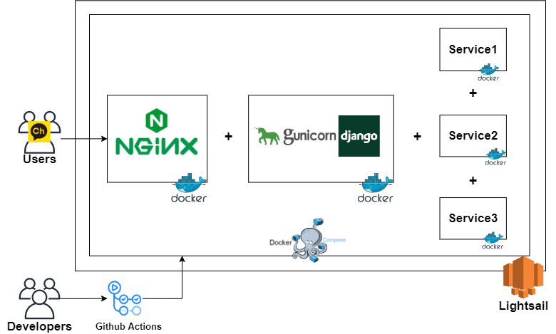

<h1 align="center">Welcome to Corona Kakao Bot 👋</h1>

  
  
    

  

<h3 align="center">
<a href="https://github.com/PARKINHYO/corona-kakao-bot/projects/13" target="_blank">
프로젝트를 고치고 있습니다(21.07.03 ~).
</a>
</h3>

### 🔑 채널 아이디 : coronavirus19

### 📷 Qr 코드

  

## 📜 사용방법

  

* <b>코로나 알리미 시작하기</b>

  * <b>1번 0시 기준 총 확진자 외 정보 확인하기</b>
  * <b>2번 금일 실시간 확진자 수 확인하기</b>
  * <b>3번 금일 지역별 코로나 재난 문자 확인하기</b>

    * <b>지역 검색</b>

    * <b>주요 지역 바로 연결</b>
    * <b>검색 창 나가기</b>
* <b>안내 사항</b>

* <b>공유하기</b>
* <b>후원하기</b>

  

## 📌 Service Flow Chart

 

  

## 📌 Architecture

 

  

## 📚 출처

* 1번 0시 기준 총 확진자 외 정보 확인하기
  * [공공데이터포털](https://www.data.go.kr/tcs/dss/selectApiDataDetailView.do?publicDataPk=15043376)
* 2번 금일 실시간 확진자 수 확인하기
  * [코로나라이브](https://corona-live.com/)
* 3번 금일 지역별 코로나 재난 문자 확인하기
  * [국민재난안전포털](https://www.safekorea.go.kr/idsiSFK/neo/sfk/cs/sfc/dis/disasterMsgList.jsp?menuSeq=679)
  * 

  

## 🖋 Author

👤 **박인효**

* Mail: [inhyopark122@gmail.com](mailto:inhyopark122@gmail.com)
* GitHub: [@PARKINHYO](https://github.com/PARKINHYO)

  

## 📝 License

Copyright © 2021 [박인효](https://github.com/parkinhyo). 
This project is [MIT](https://github.com/PARKINHYO/corona-kakao-bot/blob/master/LICENSE) licensed.
***
_This README was generated with ❤️ by [readme-md-generator](https://github.com/kefranabg/readme-md-generator)_